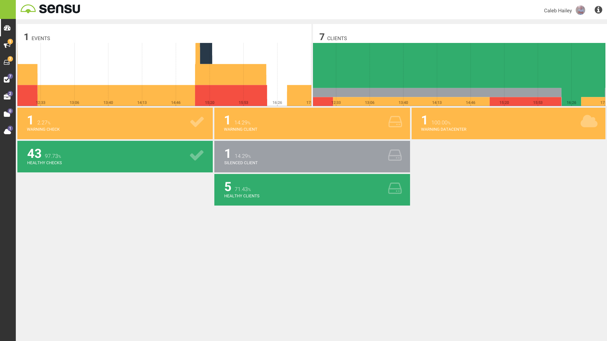

# Sensu Enterprise Dashboard HUD

As of version 1.3, a new Heads Up Display (HUD) has been added to the Sensu
Enterprise Dashboard, which provides an at-a-glance view into the overall health
of your infrastructure via a set of built-in graphs and status widgets.

## HUD RBAC Support

The HUD is scoped according to any existing [Sensu Enterprise Dashboard
RBAC](enterprise-dashboard-configuration#role-based-access-controls-rbac)
controls. For example, if a user is a member of a role with limited access to
Sensu data, they will only see history graphs and status widgets corresponding
to the Sensu Subscriptions and/or Datacenters they have access to.

_NOTE: At this time history graph data is stored in local storage via the browser,
which means that history graph data will only be available for as long as
the user has the Sensu Enterprise Dashboard open. An upcoming release of Sensu
Enterprise will be providing this data via a new "metrics API", at which point
history graph data will not be stored in the browser, and a full 8-hours of history
will be available at all times._

## Features

### History Graphs

The Sensu Enterprise Dashboard HUD includes two history graphs which provide
at-a-glance visibility for up to 8-hours of monitoring system history, captured
in 10-second intervals.

#### Event History Graph

The Event History Graph records the state of Sensu events every 10 seconds. The
graph will display the total count of critical (red), warning (yellow),
silenced (gray), and unknown (black) events. The Event History Graph retains the
last 8-hours of event history.

#### Client History Graph

The Client History Graph records the state of Sensu clients every 10 seconds.
The graph will display the total count of critical (red), warning (yellow),
silenced (gray), and healthy (green) clients. The Client History Graph retains
the last 8-hours of client history.

### Status Summary Widgets

The Sensu Enterprise Dashboard HUD includes three columns of "status widgets",
which provide at-a-glance visibility into the status of Sensu Checks, Events,
and Datacenters. Each column will only display widgets corresponding to the
current state of the monitoring system (e.g. if there are no Critical events,
the Critical event count widget will not be displayed).

#### Check Status Summary Widget(s)

The Check Status Summary widget(s) provide real-time counts for the current
state of Sensu Checks; i.e. critical (red), warning (yellow), silenced (gray),
unknown (black), and healthy (green).

#### Client Status Summary Widget(s)

The Client Status Summary widget(s) provide real-time counts for the current
state of Sensu Clients; i.e. critical (red), warning (yellow), silenced (gray),
unknown (black), and healthy (green).

#### Datacenter Status Summary Widget(s)

The Datacenter Status Summary widget(s) provide real-time counts for the current
state of the datacenters (i.e. Sensu Enterprise servers).
